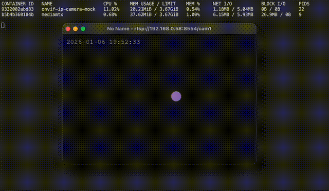

# Onvif-IP-Camera-Mock

A lightweight **IP camera simulator** written in **Rust**, capable of generating a real-time **RTSP stream** and designed to emulate **ONVIF-compatible cameras** for development, testing, and validation environments.

The project dynamically generates video frames (DVD-style bouncing animation with timestamp overlay) and publishes them to an **external RTSP server** (such as **MediaMTX**) using **FFmpeg**.

> ⚠️ This project is **not an RTSP server**.  
> It acts as an **RTSP publisher** and requires an external RTSP server.


---



## 🎯 Project Goals

- Simulate an **RTSP IP camera**
- Provide a foundation for **ONVIF (PTZ, Presets, Status) simulation**
- Enable testing of:
  - VMS systems
  - NVRs
  - Video ingestion pipelines
  - Computer vision and analytics services
- Designed to run seamlessly on **Docker**, **Docker Compose**, and **Kubernetes (AKS)**

---

## 🚀 Running with Docker Compose (Recommended)

The repository includes a ready-to-use [docker-compose.yml](docker-compose.yml) that starts both the RTSP server and the camera simulator.

```yaml
version: "3.9"

services:
  mediamtx:
    image: bluenviron/mediamtx:latest
    container_name: mediamtx
    ports:
      - "8554:8554"

  onvif-ip-camera-mock:
    image: ezequielmr94/onvif-ip-camera-mock
    depends_on:
      - mediamtx
    environment:
      RTSP_URL: rtsp://mediamtx:8554/cam1
    restart: always
```

And then just run:

```bash
docker compose up
```

To watch the stream run the following:

```bash
# using tcp stream can take a while to load
ffplay -rtsp_transport tcp rtsp://localhost:8554/cam1
```

_Of course you can use your favorite player to watch it, like VLC or whatever..._

## Environment variables

| RTSP_URL | Description |
| RTSP endpoint where the stream will be published | ab |

### Local Build (Optional)

Change those lines of [docker-compose.yml](docker-compose.yml) file to:

```yaml
onvif-ip-camera-mock:
  build: .
  container_name: onvif-ip-camera-mock
  # image: ezequielmr94/onvif-ip-camera-mock
```

Or use

```bash
docker build -t onvif-ip-camera-mock .
docker run onvif-ip-camera-mock
```

## 👩‍💻 For Developers

This section is intended for developers who want to **build, run, or extend the project locally**, without Docker.

The application itself is **fully cross-platform** and can be built and executed natively using Rust and Cargo.

---

### 🦀 Installing Rust

The recommended way to install Rust is via **rustup**.

#### macOS / Linux

```bash
curl --proto '=https' --tlsv1.2 -sSf https://sh.rustup.rs | sh
```

After installation, restart your terminal and verify:

```bash
rustc --version
cargo --version
```

This project uses Rust edition 2024, so make sure your Rust version is 1.85+ (or newer).

### Project Dependencies

The project depends on:

- Rust (edition 2024)
- FFmpeg (runtime dependency)
- An external RTSP server (e.g. MediaMTX)

### Running Project

You can use the following command to build or run the project:

```bash
cargo run
```

When running you should see log output similar to:

```code
Streaming to rtsp://127.0.0.1:8554/cam1
```

### Building Binary

To build a release binary:

```bash
cargo build --release
```

The executable will be located at:

```code
target/release/onvif-ip-camera-mock
```

You can run it directly:

```bash
RTSP_URL=rtsp://127.0.0.1:8554/cam1 ./target/release/onvif-ip-camera-mock
```

## Next steps

- [ ] support other video CODECs (HVEC, AV1, etc)
- [ ] support RTMP
- [ ] generate an mock for ONVIF showing some response to the stream screen
- [ ] configure fake detections of vehicle plates
- [ ] configure fake detections of people's face
